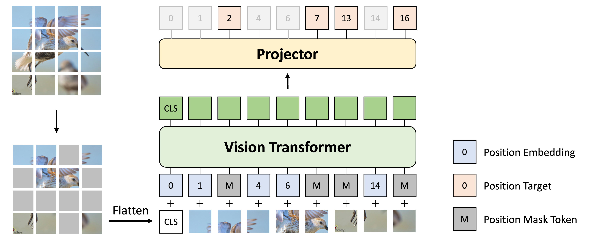

# DropPos: Pre-Training Vision Transformers by Reconstructing Dropped Positions
Official Implementation of our paper "**DropPos: Pre-Training Vision Transformers by Reconstructing Dropped Positions**. In **NeurIPS 2023**. 

by 
<a href="https://scholar.google.com/citations?user=oNlpTdcAAAAJ" target="_blank">Haochen Wang</a>,
<a href="https://scholar.google.com/citations?user=AfK4UcUAAAAJ" target="_blank">Junsong Fan</a>,
<a href="https://scholar.google.com/citations?user=waLCodcAAAAJ" target="_blank">Yuxi Wang</a>,
<a href="https://scholar.google.com/citations?user=VLqzM1wAAAAJ" target="_blank">Kaiyou Song</a>,
<a href="https://scholar.google.com/citations?user=y8cNMmkAAAAJ" target="_blank">Tong Wang</a>, and
<a href="https://scholar.google.com/citations?user=qxWfV6cAAAAJ" target="_blank">Zhaoxiang Zhang</a>

**[[arXiv]](https://arxiv.org/abs/2309.03576)**  **[[Paper]](https://arxiv.org/pdf/2309.03576.pdf)**

:bell::bell::bell: We are happy to announce that **DropPos has been accepted by NeurIPS 2023**! :bell::bell::bell:

:bell::bell::bell: The pre-trained and fine-tuned models are available [here](https://pan.baidu.com/s/1xj9XiHgagKGJrJt88IfhLw?pwd=4gik) with fetch code 4gik! :bell::bell::bell:

## Notes

* This repo is a modification on the [MAE repo](https://github.com/facebookresearch/mae). Installation and preparation follow that repo.

* This repo is based on [`timm==0.3.2`](https://github.com/rwightman/pytorch-image-models), for which a [fix](https://github.com/rwightman/pytorch-image-models/issues/420#issuecomment-776459842) is needed to work with PyTorch 1.8.1+.

* This repo is the official implementation of [DropPos: Pre-Training Vision Transformers by Reconstructing Dropped Positions](https://arxiv.org/pdf/2309.03576.pdf).

## Motivation

**TL;DR** We present a novel self-supervised pre-text task to pre-train vision transformers, *i.e.*, reconstructing dropped positions (DropPos), 
which achieved competitive results on various evaluation protocols, such as image classification, object detection, and semantic segmentation.

**Abstract.**
As it is empirically observed that Vision Transformers (ViTs) are quite insensitive to the order of input tokens, 
the need for an appropriate self-supervised pretext task that enhances the location awareness of ViTs is becoming evident. 
To address this, we present DropPos, a novel pretext task designed to reconstruct Dropped Positions. 
The formulation of DropPos is simple: we first drop a large random subset of positional embeddings 
and then the model classifies the actual position for each non-overlapping patch among all possible positions solely based on their visual appearance. 
To avoid trivial solutions, we increase the difficulty of this task by keeping only a subset of patches visible. 
Additionally, considering there may be different patches with similar visual appearances,
we propose position smoothing and attentive reconstruction strategies to relax this classification problem, 
since it is not necessary to reconstruct their exact positions in these cases. 
Empirical evaluations of DropPos show strong capabilities. DropPos outperforms supervised pre-training 
and achieves competitive results compared with state-of-the-art self-supervised alternatives on a wide range of downstream benchmarks. 
This suggests that explicitly encouraging spatial reasoning abilities, as DropPos does, indeed contributes to the improved location awareness of ViTs. 

## Method
 


## Results
| Method  | Model    | PT Epochs | Top-1 Acc.  |
|---------|----------|-----------|-------------|
| DropPos | ViT-B/16 | 200       | 83.0        |
| DropPos | ViT-B/16 | 800       | 84.2        |
| DropPos | ViT-L/16 | 800       | 85.8        |


## Acknowledgement
The pretraining and finetuning of our project are based on [DeiT](https://github.com/facebookresearch/deit), [MAE](https://github.com/facebookresearch/mae) and [HPM](https://github.com/Haochen-Wang409/HPM). 
Thanks for their wonderful work.

For object detection and semantic segmentation, please refer to [Detectron2](https://github.com/facebookresearch/detectron2) and [MMSegmentation](https://github.com/open-mmlab/mmsegmentation), respectively.
The configurations can be found in [here](https://github.com/open-mmlab/mmsegmentation/tree/master/configs/mae) and [here](https://github.com/facebookresearch/detectron2/tree/main/projects/ViTDet) for detection and segmentation, respectively.


## License
This project is under the Apache License 2.0 license. See [LICENSE](LICENSE) for details.

## Citation
```bibtex
@article{wang2023droppos,
  author  = {Wang, Haochen and Fan, Junsong and Wang, Yuxi and Song, Kaiyou and Wang, Tong and Zhang, Zhaoxiang},
  journal = {Advances in Neural Information Processing Systems (NeurIPS)},
  title   = {DropPos: Pre-Training Vision Transformers by Reconstructing Dropped Positions},
  year    = {2023},
}
```
